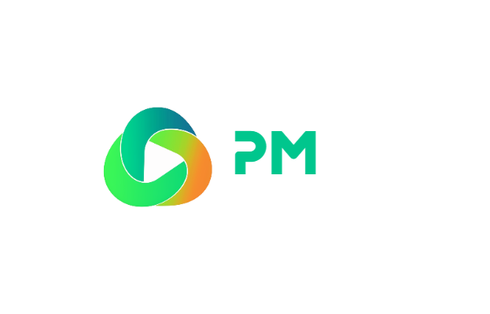
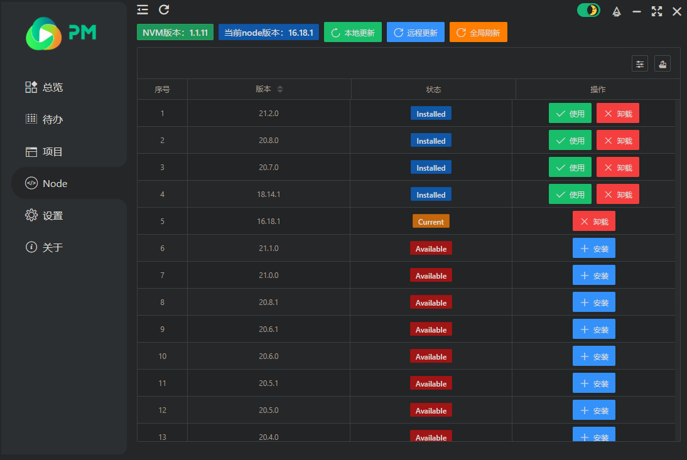
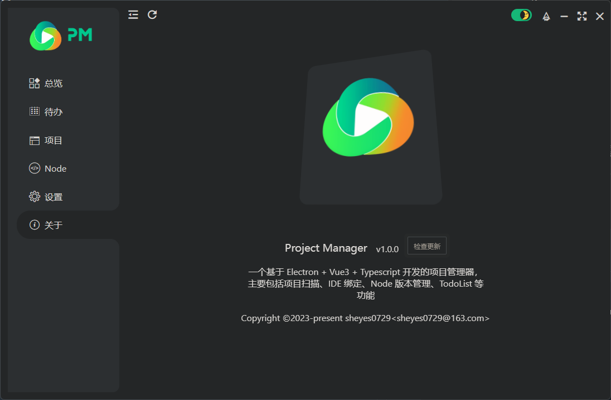

<p align="center">
  
</p>

<p align="center">
  
  
  
  
</p>

<p align="center">
  
  
</p>

<p align="center">
  
</p>

## 🐦 简介

> `Project Manager`，一个基于 Electron + Vue3 + Typescript 开发的PC端项目管理器，主要包括项目扫描、IDE绑定、Node版本管理、TodoList等功能，目前仅支持Windows

## 🌏 相关网站
- Electron中文文档：<a target="_blank" href="https://www.electronjs.org/zh/docs/latest/">https://www.electronjs.org/zh/docs/latest/</a>
- Vue中文文档：<a target="_blank" href="https://cn.vuejs.org/guide/introduction.html">https://cn.vuejs.org/guide/introduction.html</a>
- vueuse中文文档：<a target="_blank" href="https://www.vueusejs.com/guide/">https://www.vueusejs.com/guide/</a>
- Layui - vue官网：<a target="_blank" href="http://www.layui-vue.com/zh-CN/index">http://www.layui-vue.com/zh-CN/index</a>


## ♾️ 功能

- [x] 项目扫描
- [x] IDE 绑定
- [x] 暗黑主题
- [x] Node 版本管理
- [ ] TodoList
- [ ] 项目类型配置
- [x] 开机启动
- [x] 在线更新
- [ ] 项目分组
- [ ] 自定义主题

······

## 🖼️ APP截图
- 总览

- 待办

- 项目

- Node版本管理
  

- 设置

- 关于
  

## 🎉 启动

```sh
  # 克隆项目
  $ git clone https://github.com/sheyes0729/project-manager.git

  # 安装依赖
  $ pnpm i

  # 启动项目
  $ pnpm dev

  # 生成项目图标
  $ pnpm create:icons

  # 代码样式
  $ pnpm lint

  # 项目打包
  $ pnpm build:win32
```

## 🤔️ 常见问题

### **Q：使用.exe文件安装时安装失败**
> 安装时选择安装方式为`为所有用户安装`

## 📄 License
[](https://github.com/AmosHuKe/project-manager/blob/main/LICENSE)  
Open sourced under the BSD-3-Clause license.  
根据 BSD-3-Clause 许可证开源。  
© AmosHuKe