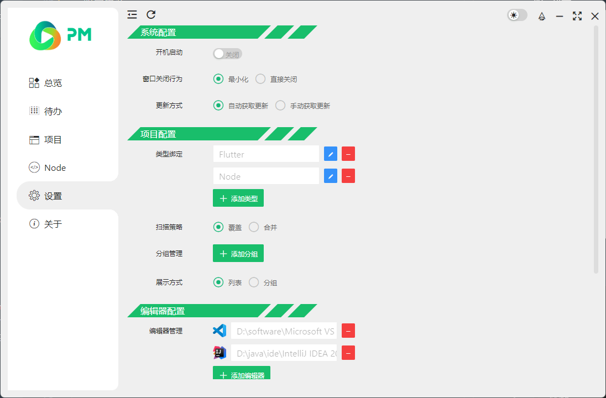
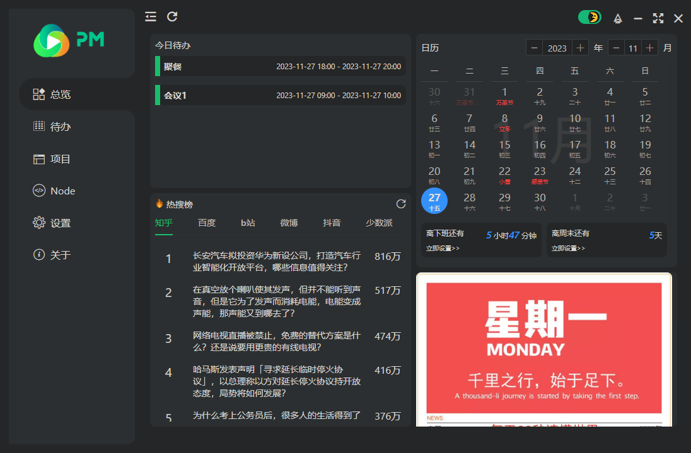
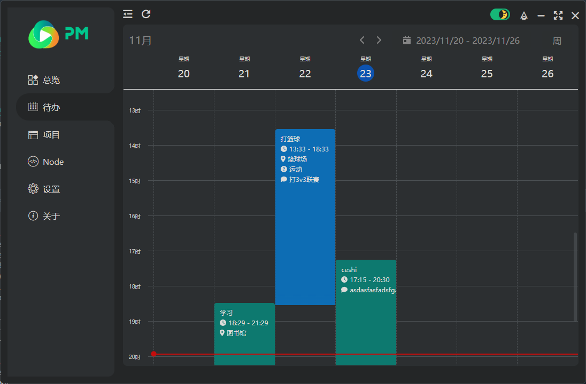
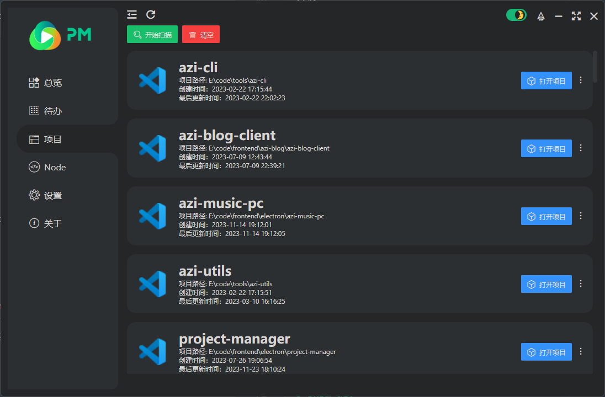
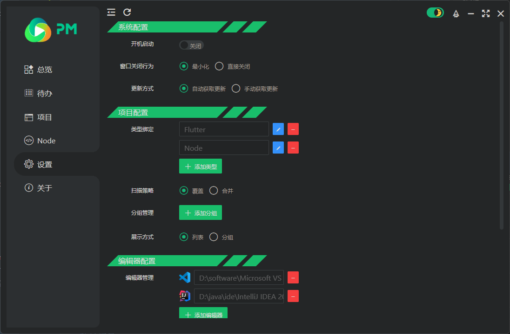

<p align="center">
  
</p>

<p align="center">
  
  
  
  
</p>

<p align="center">
  
  
</p>

## 🐦 简介

> `Project Manager`，一个基于 Electron + Vue3 + Typescript 开发的 PC 端项目管理器，主要包括项目扫描、IDE 绑定、Node 版本管理、TodoList 等功能，目前仅支持 Windows

## 🌏 相关网站

- Electron 中文文档：<a target="_blank" href="https://www.electronjs.org/zh/docs/latest/">https://www.electronjs.org/zh/docs/latest/</a>
- Vue 中文文档：<a target="_blank" href="https://cn.vuejs.org/guide/introduction.html">https://cn.vuejs.org/guide/introduction.html</a>
- vueuse 中文文档：<a target="_blank" href="https://www.vueusejs.com/guide/">https://www.vueusejs.com/guide/</a>
- Layui - vue 官网：<a target="_blank" href="http://www.layui-vue.com/zh-CN/index">http://www.layui-vue.com/zh-CN/index</a>

## ♾️ 功能

- [x] 项目扫描
- [x] IDE 绑定
- [x] 暗黑主题
- [x] NVM Node 版本管理
- [ ] 项目独立 Node 版本管理
- [x] TodoList
- [x] Todo 标签管理
- [x] 项目类型配置
- [ ] 项目扫描策略
- [ ] 项目分组
- [x] 开机启动
- [x] 在线更新
- [ ] 自定义主题
- [ ] 自定义壁纸功能

······

## 🖼️ APP 截图

- 明亮模式
  
- 总览
  
- 待办
  

- 项目
  

- Node 版本管理
  

- 设置
  

- 关于
  

## 🎉 启动

```sh
  # 克隆项目
  $ git clone https://github.com/sheyes0729/project-manager.git

  # 安装依赖
  $ pnpm i

  # 启动项目
  $ pnpm dev

  # 生成项目图标
  $ pnpm create:icons

  # 代码样式格式化
  $ pnpm lint

  # 项目打包
  $ pnpm build:win32
```

## 🤔️ 常见问题

### **Q：使用.exe 文件安装时安装失败**

> 安装时选择安装方式为`为所有用户安装`

## 📄 License

[](https://github.com/sheyes0729/project-manager/blob/main/LICENSE)  
Open sourced under the BSD-3-Clause license.  
根据 BSD-3-Clause 许可证开源。  
© sheyes0729
